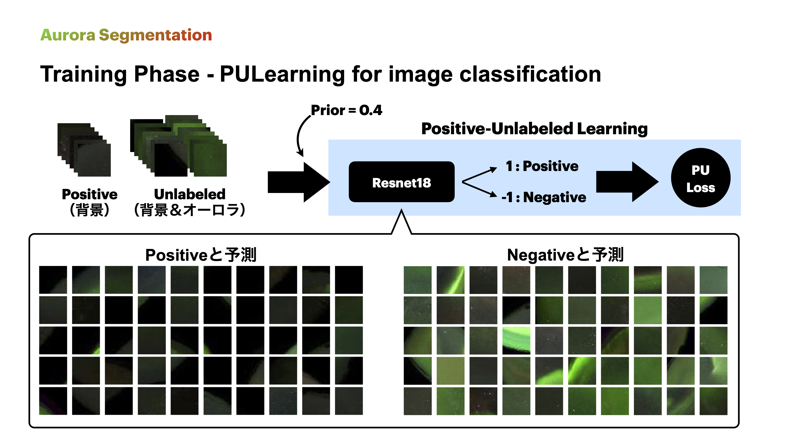
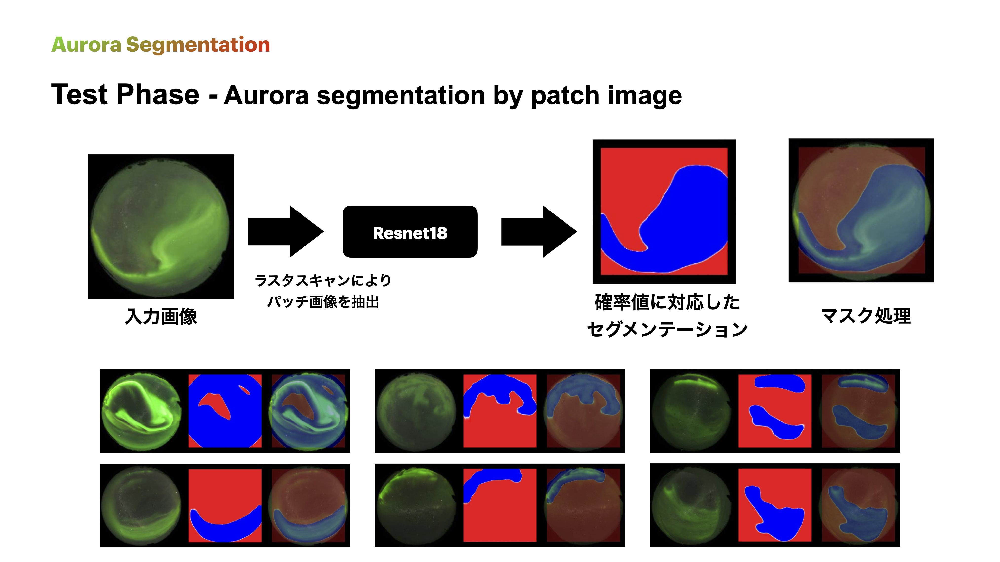
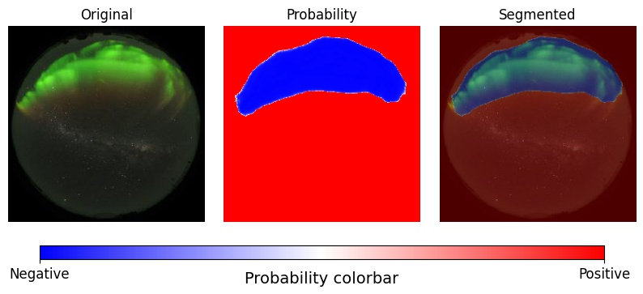
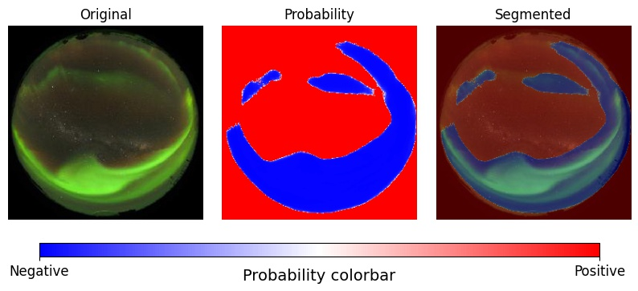
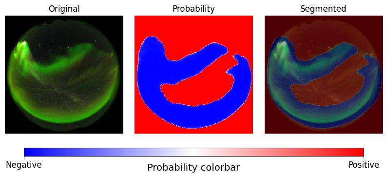
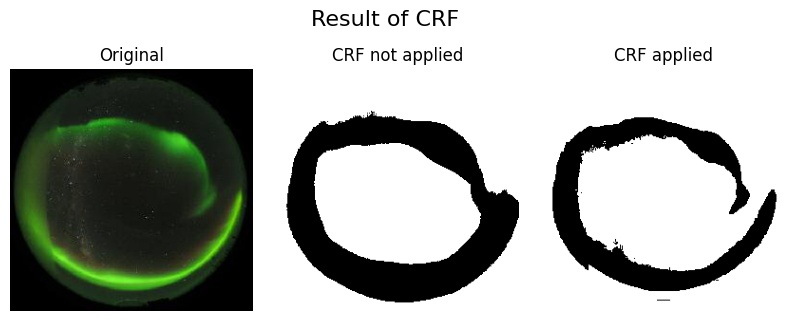
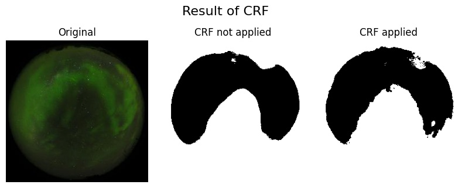

# Aurora Image Segmentation with PU Learning.

<p align="center"></p>

<p align="center"></p>

### This is for segmentation of Aurora images with a deep learning model trained by PU Learning.

`PULoss.py` is a reproducing code written in ***Keras*** for non-negative PU learning [1] and unbiased PU learning [2] in the paper "Positive-Unlabeled Learning with Non-Negative Risk Estimator", including Keras inplementation of PNU(positive-negative-unlabeled) learning [3] for deep learning. 

To get know about PU Learning, see **`pulearn.ipynb`** for a short PU Learning explanation in Japanese.

And also, fixing segmentation with CRF(Conditional Random Field) can be performed here.

- **`PULoss.py`** has a Keras implementation of the risk estimator for PNU(positive-negative-unlabeled) learning, non-negative PU (nnPU) learning and unbiased PU (uPU) learning.

- **`train.py`** is a main file to make model pu-learn and save the model. Here, segmentation is **not** performed.

- **`segmentation.py`** is a main file to segment images with a pre-trained model.

- **`make_filter.py`** has codes to produce masks for image segmentation.

- **`CRF.py`** has CRF(Conditional Random Field) code using [pydensecrf](https://github.com/lucasb-eyer/pydensecrf).

- **`data.py`** has methods to prepare data for training.

- **`model.py`** has some deep learning models.<br>
  ex) Resnet18, simple CNN, CNN refered to [1]


## Quick Start Example

### train.py

Run `train.py` to perform PNU learning and get a trained model.

```sh
python train.py --PNU True \
                --P_dataset dataset/Positive \
                --N_dataset dataset/Negative \
                --U_dataset dataset/Unlabelled \
                --save_dir [path to save folder]
```
or 
```sh
sh main.sh
```

### segmentation.py

Run `segmentation.py` to get images segmented by a trained model.

```sh
python segmentation.py --dataset [your dataset] \
                       --model [trained model path]\
                       --save_dir [path to save folder]
```
or 
```sh
sh segmenetation.sh
```

## Result Examples

As a example, we segment the aurora images with the background as positive class and the aurora as negative class. Resnet18 is trained with PNU learning methods and we segment the Unlabelled data. The dataset is from [5] and is in `dataset` folder as zip files.

The results are figures below.

<p align="center"></p>
<p align="center"></p>
<p align="center"></p>


To see how CRF works well, we apply CRF to segmented image. The results are figures below.

<p align="center"></p>
<p align="center"></p>


## Reference

[1] Ryuichi Kiryo, Gang Niu, Marthinus Christoffel du Plessis, and Masashi Sugiyama. "Positive-Unlabeled Learning with Non-Negative Risk Estimator." Advances in neural information processing systems. 2017.

[2] Marthinus Christoffel du Plessis, Gang Niu, and Masashi Sugiyama. "Convex formulation for learning from positive and unlabeled data." Proceedings of The 32nd International Conference on Machine Learning. 2015.

[3] Sakai, Tomoya, et al. "Semi-supervised classification based on classification from positive and unlabeled data." International conference on machine learning. PMLR, 2017.

[4] [Chainer implementation of non-negative PU learning and unbiased PU learning](https://github.com/kiryor/nnPUlearning)

[5] [Data Center for Aurora in NIPR](http://polaris.nipr.ac.jp/~aurora/)
