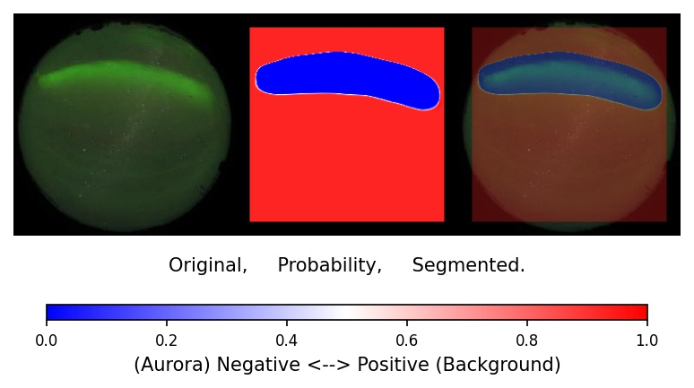
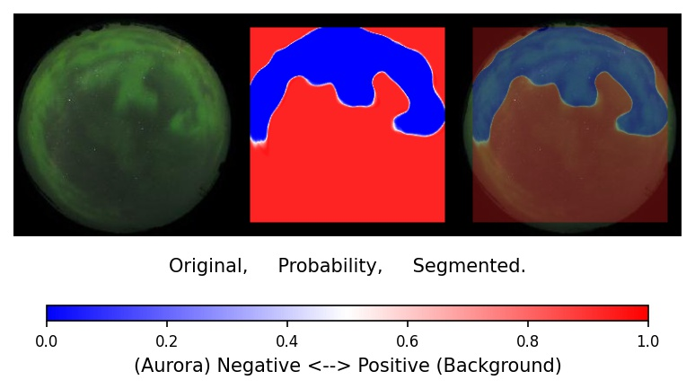
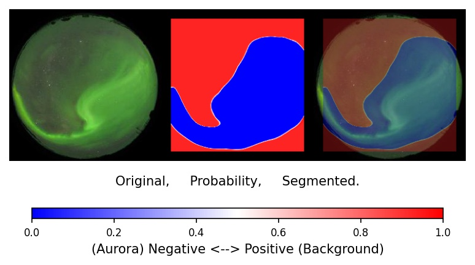
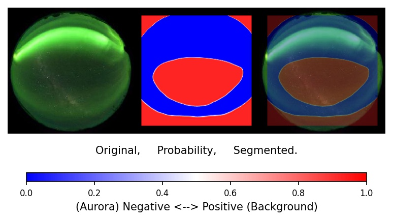

# Aurora Image Segmentation with PU Learning.

<p align="center"></p>


<p align="center"></p>

**This is for segmentation of Aurora images with a deep learning model trained by PU Learning.**

`PULoss.py` is also a reproducing code written in ***Keras*** for non-negative PU learning [1] and unbiased PU learning [2] in the paper "Positive-Unlabeled Learning with Non-Negative Risk Estimator". 

To get know about PU Learning, see **`pulearn.ipynb`** for a short PU Learning explanation in Japanese.

- **`PULoss.py`** has a Keras implementation of the risk estimator for non-negative PU (nnPU) learning and unbiased PU (uPU) learning.

- **`train.py`** is to make model pu-learn and save the model. Here, segmentation is **not** conducted.

- **`segmentation.py`** is an example code of segmentatio of image.

- **`data.py`** has methods to prepare data for training.

- **`model.py`** has some deep learning models.<br>
  ex) Resnet18, simple CNN, CNN refered to [1]


## Quick Start Example

Run `train.py`.

```sh
python train.py --P_dataset dataset/Positive --U_dataset dataset/Unlabelled
```

Run `segmentation.py`.

```sh
python segmentation.py --dataset dataset/Unlabelled --model [trained model path] --save_dir [save folder]
```

## Result Example

As a example, we segment the aurora images with the background as positive classand the aurora as negative class. Resnet18 is trained with nnPU methods and we segment the Unlabelled data. The dataset is from [4] and is in `dataset` folder as zip files.

The results are figures below.

<p align="center"></p>
<p align="center"></p>
<p align="center"></p>
<p align="center"></p>
<p align="center"></p>


## Reference

[1] Ryuichi Kiryo, Gang Niu, Marthinus Christoffel du Plessis, and Masashi Sugiyama. "Positive-Unlabeled Learning with Non-Negative Risk Estimator." Advances in neural information processing systems. 2017.

[2] Marthinus Christoffel du Plessis, Gang Niu, and Masashi Sugiyama. "Convex formulation for learning from positive and unlabeled data." Proceedings of The 32nd International Conference on Machine Learning. 2015.

[3] [Chainer implementation of non-negative PU learning and unbiased PU learning](https://github.com/kiryor/nnPUlearning)

[4] [Data Center for Aurora in NIPR](http://polaris.nipr.ac.jp/~aurora/)
